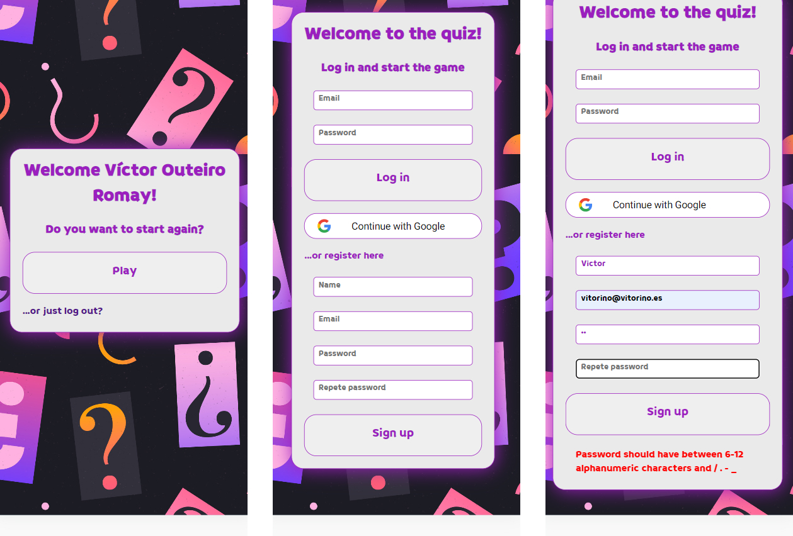
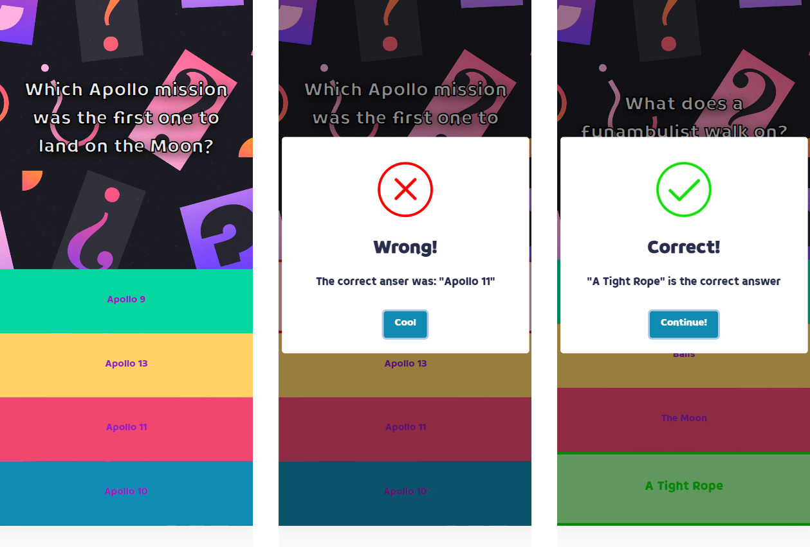
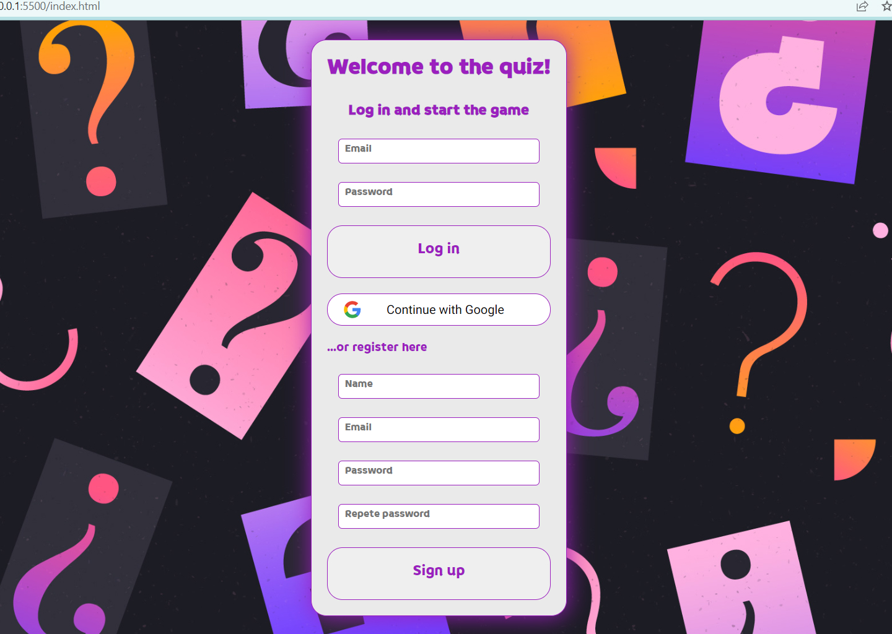
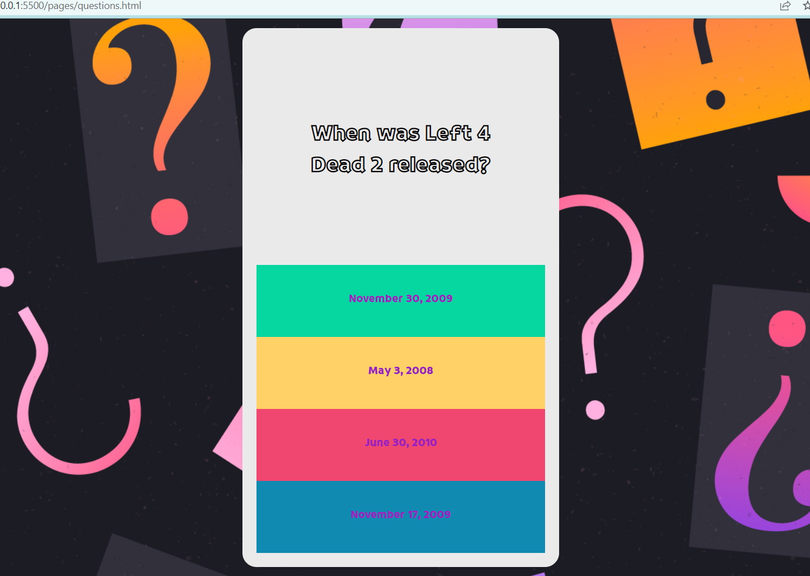

# EJERCICIO: Quiz 2.0

La aplicación consiste en un quiz de 10 preguntas aleatorias. El usuario podrá registrarse para guardar sus partidas.

## Tabla de contenidos

- [Objetivo](#objetivo)
  - [Requisitos](#requisitos)
  - [Fases](#fases)
  - [Capturas](#capturas)
  - [Links](#links)
- [Proceso](#Proceso)
  - [Construido con](#construido-con)
  - [Puntos clave](#puntos-clave)
  - [Aspectos a mejorar](#aspectos-a-mejorar)
  - [Recursos](#recursos)

## Objetivo

- El Quiz constará de 10 preguntas. Cada pregunta tendrá 4 opciones y sólo una de ellas será la correcta
- Podrán ser preguntas nuestras y preguntas que vengan de https://opentdb.com/
- La aplicación tendrá que ser una SPA (single-page application). Sólo una pregunta cada vez en pantalla

### Requisitos

- Manipulación dinámica del DOM
- Crear una página SPA para las preguntas
- Manejo de ES6
- Asincronía. Usar API de preguntas https://opentdb.com/
- APIs HTML5: Uso de Local storage y gráficas, etc...
- Sin frameworks ni librerias externas en la medida de lo posible
- Gestión del proyecto en Github desde el principio. Uso de ramas, fork, pull request, etc...
- Código limpio, buenas prácticas

### Fases

- FASE 1: Diseño del front: Diseño responsive, mobile first, semántica HTML5.
- FASE 2: Lógica de JavaScript.
- FASE 3: Asincronía: Leer 10 preguntas random de la API de prenguntas para generar el Quiz.
- FASE 4 (avanzado) - APIs HTML5: Almacenar la puntuación de cada partida en Local Storage. Mostrar en la Home con una gráfica los resultados de las últimas partidas jugadas.
- FASE 5 - Migración a Firebase (LA ÚLTIMA PARTE)
- FASE 6 - Firebase Auth (DEJAR PARA EL FINAL). Login con Google (obligatorio) y email+password

### Capturas

### Links

- Repositorio: [Add solution URL here](https://github.com/Radu-A/quiz-team-up)
- Live Site: [Add live site URL here](https://quiz-team-up.vercel.app/)

## Proceso

### Construido con

- HTML5 semántico
- CSS
- Flexbox
- Mobile-first workflow
- Diseño SPA
- Local Storage
- Firebase: Firestore y Firebase Auth

### Puntos clave

- Diseño SPA. Aprender la lógica del evento "cambio de Hash" y emplearlo para navegar dentro de una misma página
- Validación de respuestas adaptada al diseño SPA. Conseguír que la validación de las respuestas y el almacenamiento de las repuestas correctas funcione en una Single Page Aplication
- Localstorage y Firebase. Combinar ambos métodos para almacenar las partidas guardadas
- Firebase Auth. Asimilar el flujo de datos para crear una navegación adecuada en la página de inicio

### Aspectos a mejorar

- Desarrollar la lógica de una página de inicio con autenticación
- Mejorar la navegación durante la autenticación con modales
- Practicar el uso de Firebase

### Recursos

- [Example resource 1](https://www.youtube.com/watch?v=D9avX-jtIPM&t=3980s) - Tutorial sobre el uso de SPA con Vanilla Jvascript.
- [Example resource 2](https://www.youtube.com/watch?v=1rLBjRF0ep0&t=3974s) - Tutorial sobre Firebase Auth.
